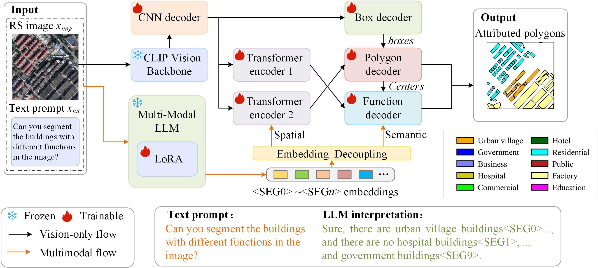

# MLBFM

The implementation for method proposed in Multimodal LLM for Function-aware Building Polygon Extraction from Remote Sensing Imagery.

##  Data preparation

- refer to the DTAT.md

##  Install the implementation environment

- refer to the INSTALL.md

##  Training on your device and datasets

### #1
  cd MLBFM_ROOT/src/lib/datasets/dataset/BuildFunc.py

  modify: "num_classes", "train_path" & "val_path"

### #2 
  cd MLBFM_ROOT/src/lib/models/dance_lib/networks/dance/evolve813.py
  
  modify: "class_num=10"

### #3 
  cd MLBFM_ROOT/src/lib/models/networks/msra_resnetv4.py

  modify: "class_num=10" 

### #4 
  cd MLBFM_ROOT/src/lib/detectors/ctdet.py

  modify: "building_functions = ['dense residential', 'business', 'commercial', 'residential', 'factory', 'government', 'hospital', 'resort', 'public', 'school']"

### #5 
  cd MLBFM_ROOT/src/lib/trains/base_trainer.py

  modify: "building_functions = ['dense residential', 'business', 'commercial', 'residential', 'factory', 'government', 'hospital', 'resort', 'public', 'school']"

### #6
  cd MLBFM_ROOT/src/lib/trains/ctdet.py

  modify: build_ce_with_fixed_weights
  
(the category weights should be set according to your datasets)

### #7
  cd MLBFM_ROOT/src/lib/opts.py

  modify: exp_id, lr_step & num_epochs (and lr, batch_size, ...)

### #8 training 
   cd MLBFM_ROOT & run python src/main.py

##  Testing on your device and datasets

### #1 
cd MLBFM_ROOT/src/preditc_rs2_buff.py
  
modify: "model_path", "save_path" & "image_path"
  
### #2
 cd MLBFM_ROOT/src & run: python preditc_rs2_buff.py
